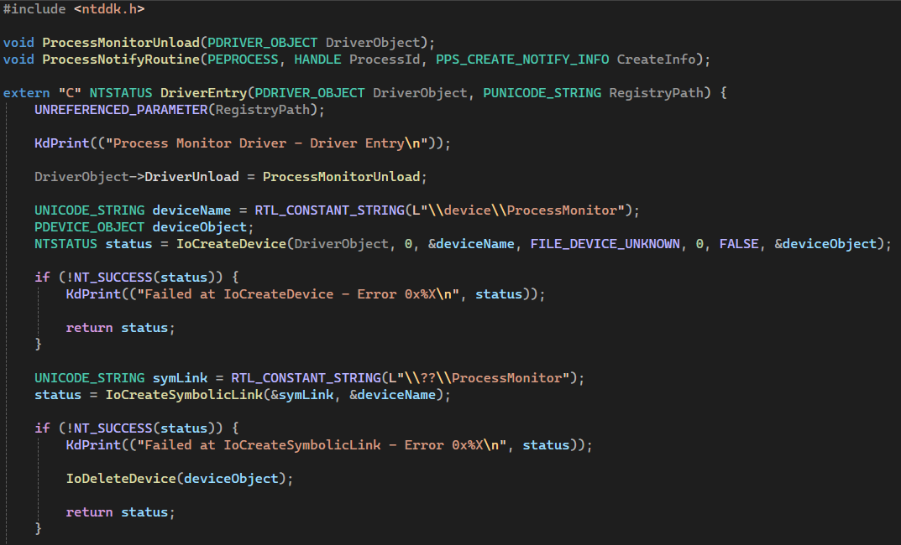
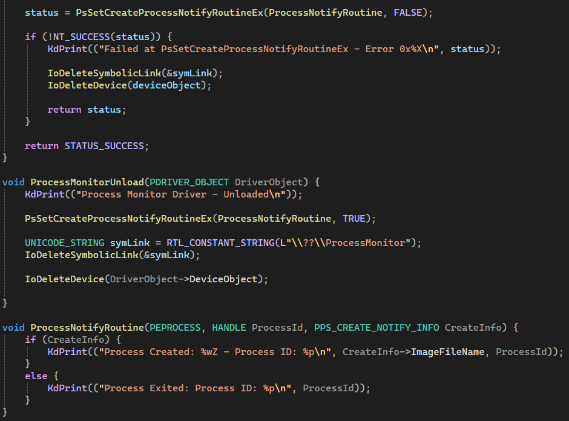

# Process Monitor - Documentation
## Date: Monday 29 December 2025

### Note:
A preview video of the project can be found in the Files folder

### Documentation:
After completing the Process Name project, Gemini gave me the next one. A kernel driver where it prints to a Debugger that a process has been created or exited. It said that this is crucial for the journey of low level security engineering and Anti-Cheats, knowing what processes are opened is a crucial step to prevent cheats.

So I started immediately with it, here's the code:  

**Explaining the code:**  
First, I initialized the base of the driver: initializing the DriverEntry function, printing a basic statement to indicate that the driver has started, made the device name and the symbolic link, though I don't think that I needed to make a symbolic link since I didn't make a user mode app for this project, but I made one either way. And handled the unloading function.

Then came the main functionality of the driver, Gemini game me that I need to use the PsSetCreateProcessNotifyRoutineEx function, I did some research on it and found its documentation on this [link](https://learn.microsoft.com/en-us/windows-hardware/drivers/ddi/ntddk/nf-ntddk-pssetcreateprocessnotifyroutineex)!

It does the job perfectly, monitor to see if a process is created or exited and fire a routine on that. It takes two arguments, the routine which basically the functionality that needs to be done when the function detects a creation or exit. And a boolean called Remove. If this is False, that means we want to use the function, if its True, then we remove the function. The value will be True when we unload the driver, exactly like I did in the ProcessMonitorUnload function.

The routine that I made is basically some print statement, one on creation, the other on exit.

And that's the whole project, it's small but fun, and let me practice the base of drivers as well as introducing me to a new kernel function.